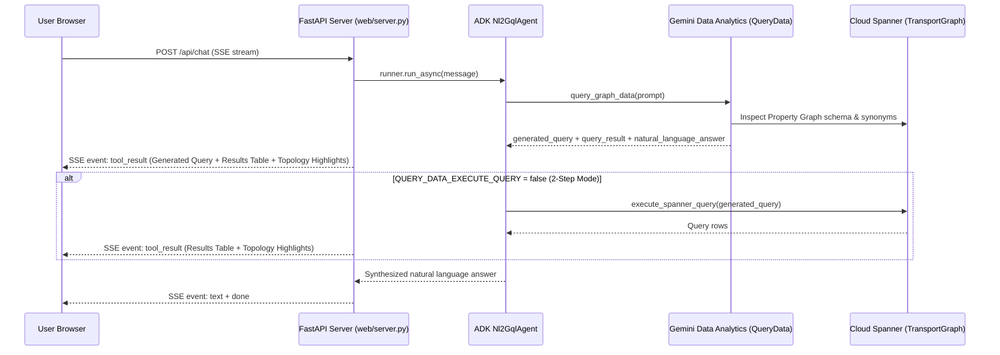

# Architecture & Domain Model

## 1. System Architecture

The **Spanner Graph NL2GQL Agent** combines three Google Cloud components into a cohesive conversational graph analytics system:

1. **Cloud Spanner Graph (`TransportGraph`)**: Stores graph entities and relationships as relational node and edge tables exposed through an ISO GQL Property Graph.
2. **Gemini Data Analytics `QueryData` (`v1alpha`)**: Translates natural language questions into Spanner GQL using the property graph's node/edge labels, `description` annotations, and `synonyms` (`graph_agent/query_data_tool.py`).
3. **Google Agent Development Kit (`Nl2GqlAgent`)**: Orchestrates multi-turn conversation, tool execution (`query_graph_data`, `execute_spanner_query`, `inspect_graph_schema`), and natural language synthesis (`graph_agent/agent.py`), exposed via both a custom **FastAPI + SSE Web UI** (`web/server.py`) and the ADK CLI/developer UI.



---

## 2. Direct vs. Two-Step Execution (`QUERY_DATA_EXECUTE_QUERY`)

The agent supports two execution modes controllable via `.env` (`QUERY_DATA_EXECUTE_QUERY`) or live per-session in the Web UI header toggle (**QueryData Direct**):

- **Direct Mode (`QUERY_DATA_EXECUTE_QUERY=true`, Default)**:
  - `QueryData` both generates the query (GQL/SQL) and executes it against Spanner in a single RPC (`generateQueryResult=true`, `generateNaturalLanguageAnswer=true`).
- **2-Step Mode (`QUERY_DATA_EXECUTE_QUERY=false`)**:
  1. `query_graph_data` calls `QueryData` with `generateQueryResult=false` to produce the query and intent explanation.
  2. `execute_spanner_query` executes that query against Cloud Spanner using the ADK Spanner read-only toolset (`Capabilities.DATA_READ`).

---

## 3. Schema-Grounded Fallback (`NL2GQL_BACKEND=gemini`)

If a user's GCP project does not yet have preview access to the `geminidataanalytics.googleapis.com` `QueryData` Spanner Graph datasource:

- **Automatic Fallback**: When `query_graph_data` returns an API error, the agent automatically invokes `inspect_graph_schema` (`graph_agent/graph_schema_tool.py`), which queries `INFORMATION_SCHEMA.PROPERTY_GRAPHS` (`PROPERTY_GRAPH_METADATA_JSON`) and optional local `schema.sql` DDL annotations (`description` and `synonyms`), then writes and executes the query via `execute_spanner_query`.
- **Explicit Gemini Mode**: Setting `NL2GQL_BACKEND=gemini` in `.env` configures the agent to use `inspect_graph_schema` + `execute_spanner_query` directly without calling `QueryData`.

---

## 4. Schema Agnosticism & External Sample Prompts

The agent is decoupled from any specific dataset or domain schema:

- **Dynamic Schema Discovery**: `QueryData` and `inspect_graph_schema` inspect the target Spanner Property Graph (`SPANNER_GRAPH_IDS`) directly from `INFORMATION_SCHEMA.PROPERTY_GRAPHS` at runtime. No dataset-specific table names, labels, or entity IDs are hardcoded in the agent.
- **External Sample Prompts (`sample_prompts.example.json` / `SAMPLE_PROMPTS_FILE`)**: By default, the Web UI displays generic schema-discovery and connectivity starter prompts. An example file is provided at [`sample_prompts.example.json`](../sample_prompts.example.json). To provide dataset-specific sample prompts separately, copy `sample_prompts.example.json` to `sample_prompts.json` (or `local_data/sample_prompts.json`, which is gitignored) or set `SAMPLE_PROMPTS_FILE=/path/to/prompts.json`:
  ```json
  [
    {
      "category": "Category Name",
      "prompts": [
        "First sample natural language question?",
        "Second sample natural language question?"
      ]
    }
  ]
  ```
- **Sample Prompts Visibility (`SHOW_SAMPLE_PROMPTS`)**: Set `SHOW_SAMPLE_PROMPTS=false` in `.env` (default `true`) to hide the sample prompts sidebar and starter cards by default when the Web UI loads. Users can also toggle sample prompts on or off at any time using the **Sample Prompts** toggle in the top header.
- **Optional Topology Map (`topology.json` / `TOPOLOGY_FILE`)**: If a `topology.json` file is provided in `local_data/topology.json`, the repository root, or via `TOPOLOGY_FILE`, the Web UI enables an interactive SVG topology map that highlights matched entities returned by tool executions.
